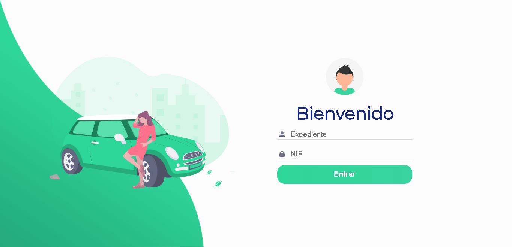
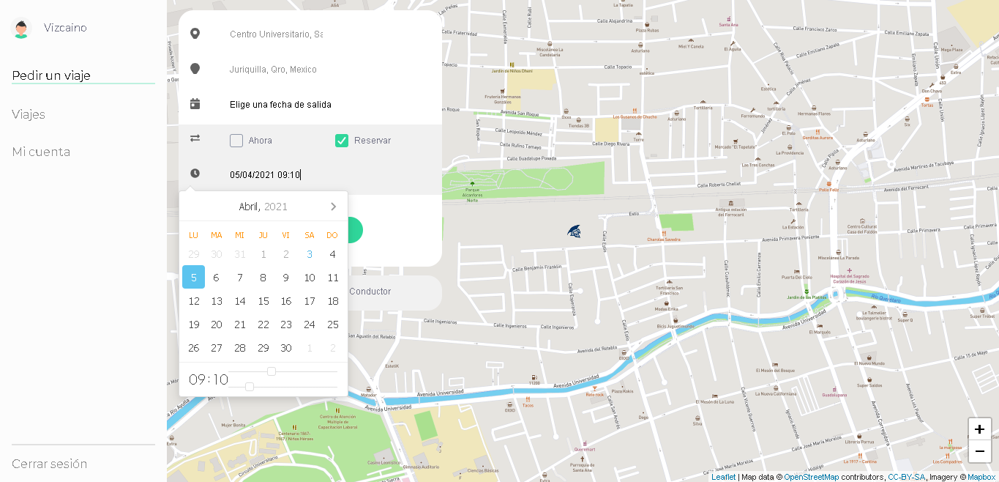
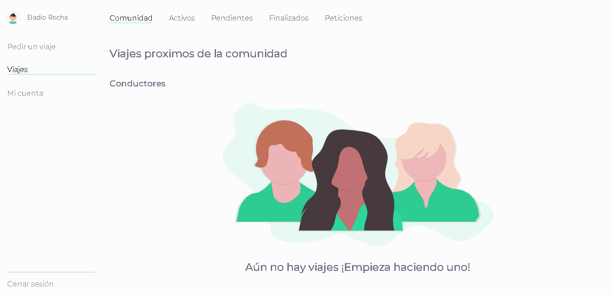
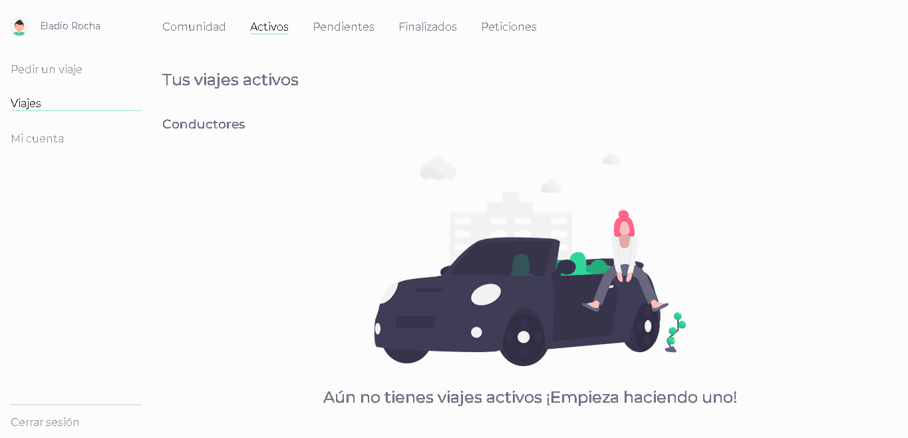
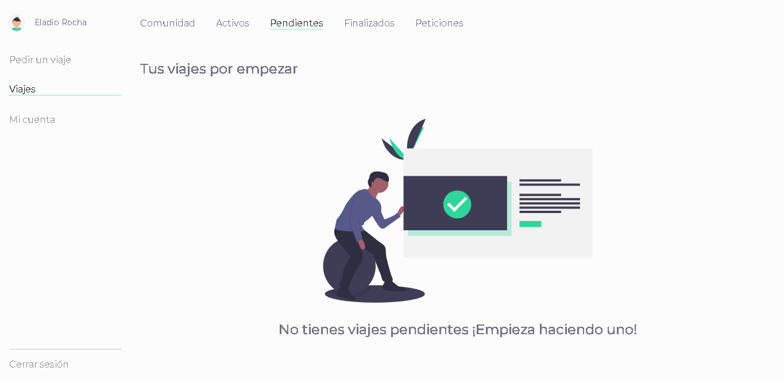
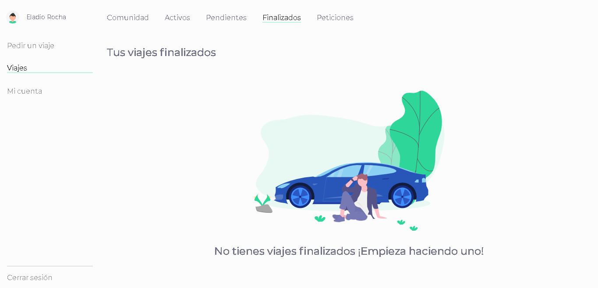
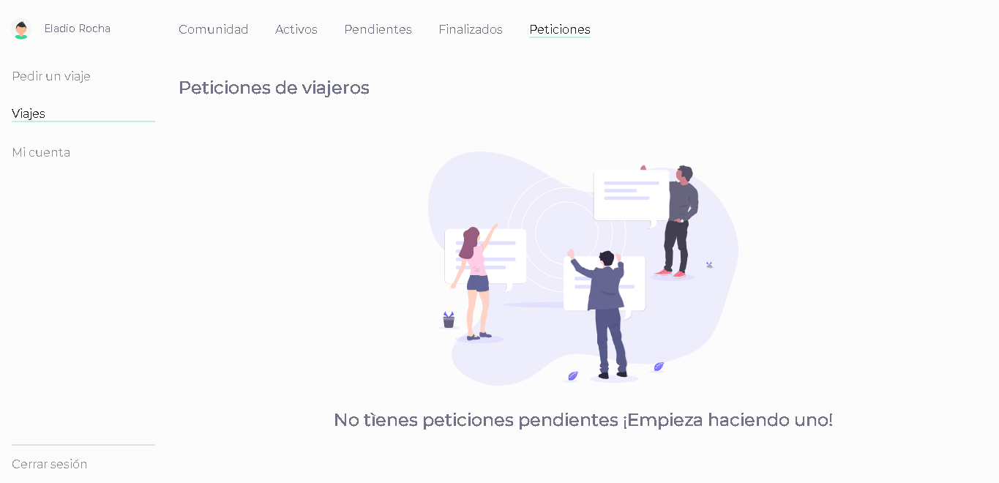
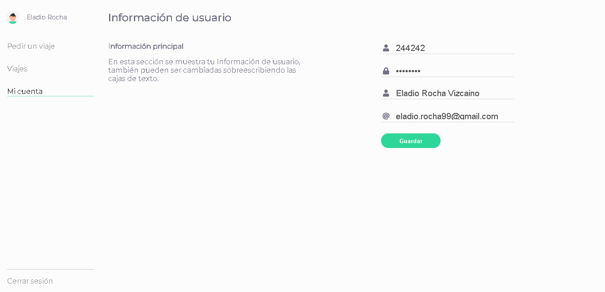

# Motum — University Carpooling Prototype

A university carpooling prototype with a **vanilla HTML/CSS/JavaScript frontend, Express backend, MongoDB, and Socket.IO**. The project contains account, map, ride-request, history, and profile workflows.

## Setup

Use Node.js, npm, and a development MongoDB instance. Install dependencies from the repository root:

```sh
npm ci
```

Configure your local `.env` with `DB_DEV` (MongoDB URI), `PORT_DEV` (application port), and `JWT_KEY_DEV` (a private JWT signing secret). The repository contains historical environment configuration; use your own values. `index.js` loads dotenv and starts both the web application and Socket.IO server.

```sh
npm start
```

Open the configured local port. The login and map workflows depend on additional integrations: inspect [helpers/uaq-authentication.js](helpers/uaq-authentication.js), map scripts, and client URLs before attempting a full session. Do not assume that historical university authentication or map services remain compatible.

## Project structure

| Path | Purpose |
| --- | --- |
| [index.js](index.js) | MongoDB connection, socket authentication, and HTTP startup. |
| [server.js](server.js) | Express configuration. |
| [routes](routes) | Page, account, and ride endpoints. |
| [api](api) | Controllers, middleware, and MongoDB models. |
| [public](public) | Browser scripts and styles. |
| [views](views) | Landing, login, map, history, and profile pages. |

## Original screenshots

These images document the historical interface rather than a newly verified deployment.


















## Validation and limitations

`npm test` is a placeholder that exits with an error. `node --check index.js` checks entry-point syntax without connecting to MongoDB. Dependencies include older native and browser-automation packages. Full login, maps, sockets, and ride transitions were not exercised for this documentation update. Some chat logic is commented out, so the presence of a model or UI does not establish a complete live chat implementation.
